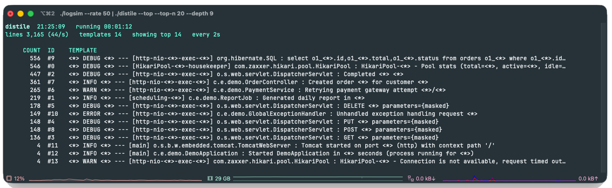

#  distile

**See what your logs are actually saying, without reading every line.**

When an app runs, it writes thousands of log lines, mostly the same
messages over and over, just with different values:

    2026-07-19T10:00:00.100Z  INFO 24236 --- [http-nio-8080-exec-3] c.e.demo.OrderController : Created order 33712 for customer 7708
    2026-07-19T10:00:00.137Z ERROR 24236 --- [http-nio-8080-exec-8] c.e.demo.GlobalExceptionHandler : Unhandled exception handling request 5ad9d4ac-5a59-5c50-f7cd-524471cef2da
    2026-07-19T10:00:00.174Z DEBUG 24236 --- [HikariPool-1-housekeeper] com.zaxxer.hikari.pool.HikariPool : HikariPool-1 - Pool stats (total=10, active=7, idle=3, waiting=2)
    2026-07-19T10:00:00.211Z  INFO 24236 --- [http-nio-8080-exec-7] c.e.demo.OrderController : Created order 99662 for customer 9961
    2026-07-19T10:00:00.248Z ERROR 24236 --- [http-nio-8080-exec-8] c.e.demo.GlobalExceptionHandler : Unhandled exception handling request 41ad07fd-8555-5715-2566-e91d4157082a
    2026-07-19T10:00:00.285Z ERROR 24236 --- [http-nio-8080-exec-4] c.e.demo.GlobalExceptionHandler : Unhandled exception handling request c1bbbd6e-d6f9-223e-1001-1a26077d6f97

On a console scrolling by thousands of lines, the messages
that matter drown in the noise. distile groups lines of the same shape
into one **template** (the fixed part of the message) with the changing
parts replaced by `<*>` and counts each one:

    [SNAPSHOT  2026-07-19T10:02:14.318]  top 10 of 14 templates
    1019  #2  <*> DEBUG <*> --- [HikariPool-<*>-housekeeper] com.zaxxer.hikari.pool.HikariPool : HikariPool-<*> - Pool stats (total=<*>, active=<*>, idle=<*>, waiting=<*>)
     616  #3  <*> INFO <*> --- [http-nio-<*>-exec-<*>] c.e.demo.OrderController : Created order <*> for customer <*>
     288  #10  <*> ERROR <*> --- [http-nio-<*>-exec-<*>] c.e.demo.GlobalExceptionHandler : Unhandled exception handling request <*>

So instead of hundreds of near-identical lines, you see the handful of
things your app is really doing, each with a count, and the rare error
hiding among them finally stands out.

It runs locally on a live stream:

    tail -f app.log | ./distile

Or add `--top` for a live, `top`-style view that refreshes in place instead of scrolling:
templates ranked by count, a header bar with throughput and totals, and a cyan flash
whenever a new pattern first appears.

    ./logsim --rate 50 | ./distile --top --top-n 20 --depth 9



Under the hood, distile is a from-scratch Java implementation of the
[Drain](https://ieeexplore.ieee.org/document/8029742) algorithm, a streaming log-template extractor. Everything stays on your machine and in
memory (just the templates and their counts).

## Quick start

Requires **Java 21** and **Maven**.

```bash
mvn package                       # builds target/distile.jar
tail -f app.log | ./distile       # or: ./distile -f app.log
```

## Usage

```
distile [FILE] [options]

  -f, --file <path>          read a file (or pass it positionally); default: stdin
      --tail                 keep reading appended lines (like tail -f)
      --json                 emit JSONL instead of text
      --top                  live full-screen top-like view (refreshes in place)
      --top-n <n>            templates shown per snapshot        (default 10)
      --snapshot-interval <s> seconds between Top-N snapshots; 0 = off (default 5, or 2 with --top)
      --no-emit-new          don't print an event on each new template
      --milestones [set]     emit on count milestones; no value = 1,10,100,…
      --outlier-max <n>      count <= n counts as an outlier      (default 2)
      --sim-threshold <0..1> similarity needed to join a cluster  (default 0.5)
      --depth <n>            parse-tree depth                     (default 4)
      --max-children <n>     max node fan-out before <*> overflow (default 100)
      --masks-file <path>    custom mask rules (replaces defaults)
  -h, --help / -V, --version
```

Emission runs two layers by default: a `[NEW]` event when a template first
appears, and a Top-N snapshot every 5s. On stream end (or Ctrl-C) it prints the
full ranked list plus outliers.

`--top` replaces the scrolling output with a live, full-screen `top`-like view
that refreshes in place (every 2s by default): a header bar (clock, running time,
lines + throughput, template count + new-this-frame) above the ranked table, with
rows that are new or growing highlighted. Works over a pipe
(`tail -f app.log | distile --top`) or a file (`distile --top --tail app.log`);
Ctrl-C exits. When output is not an interactive
terminal (e.g. redirected to a file) it falls back to plain text. Log rotation
following is not yet handled.

## Try it

A built-in generator emits fake **Spring Boot 3** console logs: Spring MVC, Hibernate,
HikariCP, Tomcat to exercise distile live:

```bash
./logsim --rate 40 | ./distile --snapshot-interval 3 --depth 9
```

Raw lines look like a real app's console:

```
2026-07-19T10:00:00.037Z DEBUG 24236 --- [http-nio-8080-exec-3] o.s.web.servlet.DispatcherServlet        : Completed 409 Conflict
2026-07-19T10:00:00.074Z DEBUG 24236 --- [HikariPool-1-housekeeper] com.zaxxer.hikari.pool.HikariPool        : HikariPool-1 - Pool stats (total=10, active=7, idle=3, waiting=2)
```

…and distile collapses thousands of them into the handful of patterns actually happening:

```
[SNAPSHOT  2026-07-19T10:02:31.512]  top 10 of 14 templates
    1029  #0  <*> DEBUG <*> --- [http-nio-<*>-exec-<*>] org.hibernate.SQL : select o1_<*>.id,o1_<*>.total,o1_<*>.status from orders o1_<*> where o1_<*>.id=?
    1019  #2  <*> DEBUG <*> --- [HikariPool-<*>-housekeeper] com.zaxxer.hikari.pool.HikariPool : HikariPool-<*> - Pool stats (total=<*>, active=<*>, idle=<*>, waiting=<*>)
     616  #3  <*> INFO <*> --- [http-nio-<*>-exec-<*>] c.e.demo.OrderController : Created order <*> for customer <*>
     298  #5  <*> DEBUG <*> --- [http-nio-<*>-exec-<*>] o.s.web.servlet.DispatcherServlet : POST <*> parameters={masked}
```

Why `--depth 9`? Framework logs prepend a fixed multi-token prefix (timestamp, level, PID,
thread, logger…) before the real message, and distile groups by leading tokens, so the
tree has to reach past that prefix to tell events apart. The default `--depth 4` still gives
a tidy summary; it just lumps the DispatcherServlet lines together. See
[DESIGN.md](docs/DESIGN.md#tree-depth-and-framework-prefixes) for the full reasoning.

## Log4j2 appender

For your own JVM apps you can skip the file round-trip and plug distile straight into
Log4j2, so log events are distilled **in-process**. Add distile as a dependency, then
register the appender in your `log4j2.xml`:

```xml
<Configuration>
  <Appenders>
    <Distile name="distile" snapshotInterval="5" topN="10"/>
  </Appenders>
  <Loggers>
    <Root level="info">
      <AppenderRef ref="distile"/>
    </Root>
  </Loggers>
</Configuration>
```

distile ships its Log4j2 plugin descriptor, so the appender is found automatically.

Attributes mirror the CLI flags: `simThreshold`, `depth`, `maxChildren`, `topN`,
`snapshotInterval`, `emitNew`, `json`, `outlierMax`, and `file` (output path; defaults to
stdout).

When you log with parameters, such as `log.info("user {} logged in from {}", id, ip)`, the
appender knows the `{}` positions are variables and marks them directly, so templates are
clean from the first line. Concatenated messages fall back to the same masking the stdin
path uses. Either way a message clusters to the same template it would via stdin.

The appender sees the *message* before serialization, so its templates carry no timestamp
or level prefix, cleaner than tailing a rendered log file. distile keeps only templates and
counts; it never stores the actual parameter values.

## Design & internals

How distile is built lives in **[DESIGN.md](docs/DESIGN.md)**: the layered architecture, the
per-line algorithm, terminal handling for `--top`, and the performance, scale, and acceptance
tests.

## License

[MIT](LICENSE) © Korhan Gülseven

