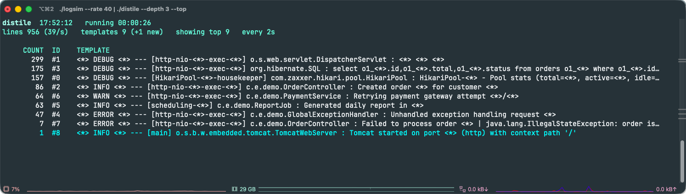

#  distile

**See what your logs are actually saying, without reading every line.**

[](#install)
[](https://github.com/kguelseven/distile/actions/workflows/ci.yml)
[](https://github.com/kguelseven/distile/releases/latest)
[](LICENSE)

A Java implementation of the [Drain](https://ieeexplore.ieee.org/document/8029742) streaming log-template extractor.
It runs on your machine, against your terminal, with no agent and no backend to set up.
Everything stays local and in memory: just the templates and their counts.

- **[Pipe it anything](#try-it)**: `tail -f app.log | distile`, or let distile tail the file itself
- **[Live `top`-style view](#live-view)**: `--top` ranks templates in place, flags new ones as they appear
- **[Log4j2 appender](#log4j2-appender)**: distil in-process; parameters are known, so templates are clean from line one

## What it does

When an app runs, it writes thousands of log lines, mostly the same messages over and
over, just with different values:

```
2026-07-19T10:00:00.100Z  INFO 24236 --- [exec-3] c.e.demo.OrderController : Created order 33712 for customer 7708
2026-07-19T10:00:00.137Z DEBUG 24236 --- [exec-3] o.s.web.servlet.DispatcherServlet : POST /api/orders parameters={masked}
2026-07-19T10:00:00.174Z ERROR 24236 --- [exec-8] c.e.demo.ExceptionHandler : Unhandled exception handling request 5ad9d4ac
2026-07-19T10:00:00.211Z  INFO 24236 --- [exec-7] c.e.demo.OrderController : Created order 99662 for customer 9961
2026-07-19T10:00:00.248Z DEBUG 24236 --- [exec-5] o.s.web.servlet.DispatcherServlet : POST /api/payments parameters={masked}
2026-07-19T10:00:00.285Z ERROR 24236 --- [exec-4] c.e.demo.ExceptionHandler : Unhandled exception handling request 41ad07fd
2026-07-19T10:00:00.322Z DEBUG 24236 --- [exec-9] o.s.web.servlet.DispatcherServlet : POST /api/orders/33712/items parameters={masked}
```

On a console scrolling by thousands of lines, the messages that matter drown in the noise.
distile groups lines of the same shape into one **template**: the fixed part of the
message, with the changing parts replaced by `<*>`. Each template carries a count of how
often it was seen:

```
[SNAPSHOT  2026-07-19T10:02:14.318]  top 10 of 14 templates
 616  #3   <*>  INFO <*> --- [exec-<*>] c.e.demo.OrderController          : Created order <*> for customer <*>
 298  #5   <*> DEBUG <*> --- [exec-<*>] o.s.web.servlet.DispatcherServlet : POST <*> parameters={masked}
 288  #10  <*> ERROR <*> --- [exec-<*>] c.e.demo.ExceptionHandler         : Unhandled exception handling request <*>
…
```

So instead of hundreds of near-identical lines, you see the handful of things your app is 
really doing, each with a count.

### Live view

Add `--top` for a live, `top`-style view that refreshes in place instead of scrolling:
templates ranked by count, a header bar with throughput and totals, and a cyan flash
whenever a new pattern first appears.

```bash
tail -f app.log | distile --top
```



## Install

```bash
brew tap kguelseven/distile https://github.com/kguelseven/distile
brew trust kguelseven/distile
brew install distile
```

The tap URL is needed because the formula ships in this repo rather than a separate
`homebrew-distile` tap, and `brew trust` is Homebrew's gate on any formula outside
homebrew/core. Homebrew pulls in its own JDK, so nothing else is required.

Or grab `distile-<version>.jar` from the
[latest release](https://github.com/kguelseven/distile/releases/latest) and run
`java -jar distile.jar` (Java 21+).

### From source

Requires **Java 21** and **Maven**.

```bash
mvn package                       # builds target/distile.jar
```

The `./distile` launcher finds the JAR next to itself or in `target/`, so it works from a
clone and from an unpacked release tarball alike.

## Try it

Point distile at a stream, either a pipe or a file it tails itself:

```bash
tail -f app.log | distile          # anything on stdin
distile --tail app.log             # or let distile do the tailing
```

No logs handy? A built-in generator emits fake **Spring Boot 3** console logs (Spring MVC,
Hibernate, HikariCP, Tomcat) so you can exercise distile live:

```bash
./logsim --rate 40 | ./distile --snapshot-interval 3 --depth 9
```

Raw lines look like a real app's console:

```
2026-07-19T10:00:00.037Z DEBUG 24236 --- [http-nio-8080-exec-3] o.s.web.servlet.DispatcherServlet        : Completed 409 Conflict
2026-07-19T10:00:00.074Z DEBUG 24236 --- [HikariPool-1-housekeeper] com.zaxxer.hikari.pool.HikariPool        : HikariPool-1 - Pool stats (total=10, active=7, idle=3, waiting=2)
```

…and distile collapses thousands of them into the handful of patterns actually happening:

```
[SNAPSHOT  2026-07-19T10:02:31.512]  top 10 of 15 templates
    1984  #2  <*> DEBUG <*> --- [HikariPool-<*>-housekeeper] com.zaxxer.hikari.pool.HikariPool : HikariPool-<*> - Pool stats (total=<*>, active=<*>, idle=<*>, waiting=<*>)
    1896  #1  <*> DEBUG <*> --- [http-nio-<*>-exec-<*>]      org.hibernate.SQL                 : select o1_<*>.id,o1_<*>.total,o1_<*>.status from orders o1_<*> where o1_<*>.id=?
    1072  #7  <*>  INFO <*> --- [http-nio-<*>-exec-<*>]      c.e.demo.OrderController          : Created order <*> for customer <*>
     880  #4  <*>  WARN <*> --- [http-nio-<*>-exec-<*>]      c.e.demo.PaymentService           : Retrying payment gateway attempt <*>/<*>
     600  #8  <*> DEBUG <*> --- [http-nio-<*>-exec-<*>]      o.s.web.servlet.DispatcherServlet : POST <*> parameters={masked}
```

The thread, logger and message land in columns: the logger had already aligned them
with `%-40.40logger` and `%5p`, and distile puts that back after tokenizing threw it away.

`--depth 9` is there because framework logs prepend a fixed multi-token prefix (timestamp,
level, PID, thread, logger…) before the real message, and distile groups by leading tokens.
The tree therefore has to reach past that prefix to tell events apart. The default `--depth 4`
still gives a tidy summary; it just lumps the DispatcherServlet lines together. Full
reasoning in [DESIGN.md](docs/DESIGN.md#tree-depth-and-framework-prefixes).

## Reading the output

Every distile line starts with a bracketed tag, padded to a fixed column so its output
stays visually distinct from your app's own lines:

| Tag | When | Shape |
| --- | --- | --- |
| `[NEW]` | a template is seen for the first time | `#id  template` |
| `[MILESTONE]` | a count crosses 1, 10, 100, … | `#id  template  (x100)` |
| `[SNAPSHOT]` | every `--snapshot-interval` seconds | `top N of M templates`, then a table |
| `[FINAL]` | stream end or Ctrl-C | full ranked table, then the outlier table |

Snapshot and final tables are `count  #id  template`, sorted by count descending. The
final report closes with `-- outliers (count <= threshold): N --`, listing the rare
templates (count ≤ `--outlier-max`). Those are often the interesting ones.

- `<*>` is a variable: either masked before matching (timestamps, IPs, UUIDs, numbers) or
  discovered as a position where lines of the same shape disagreed.
- `#id` is a stable cluster id. The same template keeps its number for the life of the
  process, so you can follow one across snapshots.

Inside a table, distile squares the record's fields into columns so you can scan down one
instead of re-reading every line. Nothing to configure: it reads the columns off the rows
it is about to print, and a format that offers no structure (Go's `log`, nginx access logs,
JSON lines) prints exactly as it always did rather than guessing. Details in
[DESIGN.md](docs/DESIGN.md#column-alignment).

## Options

```
distile [FILE] [options]

  -f, --file <path>          read a file (or pass it positionally); default: stdin
      --tail                 keep reading appended lines (like tail -f)
      --json                 emit JSONL instead of text
      --top                  live full-screen top-like view (refreshes in place)
      --top-n <n>            templates shown per snapshot        (default 10)
      --snapshot-interval <s> seconds between Top-N snapshots; 0 = off (default 5, or 2 with --top)
      --no-emit-new          don't print an event on each new template
      --milestones [set]     emit on count milestones; no value = 1,10,100,…
      --outlier-max <n>      count <= n counts as an outlier      (default 2)
      --no-join-traces       treat every line of a Java stack trace as its own record
      --trace-frames <n>     trace lines kept after the exception   (default 1)
      --sim-threshold <0..1> similarity needed to join a cluster  (default 0.5)
      --depth <n>            parse-tree depth                     (default 4)
      --max-children <n>     max node fan-out before <*> overflow (default 100)
      --masks-file <path>    custom mask rules (replaces defaults)
  -h, --help / -V, --version
```

By default two layers emit: a `[NEW]` event when a template first appears, and a Top-N
snapshot every 5s. On stream end (or Ctrl-C) it prints the full ranked list plus outliers.
Milestones are off until you go hunting a spike.

### Stack traces

A Java stack trace is one log event spread over dozens of lines. Left alone, every frame
becomes its own template, and one error bumps counts thirty times so distile folds a
trace into a single record before clustering:

```
2026-07-26 10:00:01 ERROR c.e.OrderService : Failed to process order 4711
java.lang.IllegalStateException: no such order
	at com.example.OrderService.load(OrderService.java:42) ~[classes/:na]
	at com.example.OrderService.process(OrderService.java:17) ~[classes/:na]
	at java.base/java.lang.Thread.run(Thread.java:840) ~[na:na]
Caused by: java.sql.SQLException: connection reset
	at com.zaxxer.hikari.Pool.get(Pool.java:120) ~[HikariCP-5.0.1.jar:na]
	... 43 common frames omitted
```
```
1  #0  <*> <*> ERROR c.e.OrderService : Failed to process order <*> | java.lang.IllegalStateException: no such order | at com.example.OrderService.load(OrderService.java:<*>) ~[classes/:na]
```

The log line, the exception and the throw site are kept; the rest of the trace is dropped.
That's deliberate: frame counts vary between occurrences of the same error, so keeping
them all would split one error into several templates. `--trace-frames <n>` widens or
narrows it (`0` keeps the exception only), and `--no-join-traces` turns it off entirely.

Detection is Java-specific and needs no configuration: `at …(File.java:42)`,
`Caused by:`, `Suppressed:` and `… N common frames omitted` are shapes
`Throwable.printStackTrace` emits and every framework reproduces. Anything else is left
alone, so an unrecognised line is simply its own record.

### top View

`--top` replaces that scrolling output with the live full-screen view, refreshing every 2s
by default. A header bar sits above the ranked table showing the clock, running time, lines
and throughput, and the template count with how many are new this frame; rows that are new
or growing are highlighted. It works over a pipe (`tail -f app.log | distile --top`) or on
a file (`distile --top --tail app.log`), and Ctrl-C exits. `[NEW]` and `[MILESTONE]` events
stay silent in this mode, because the table *is* the view. When output isn't an interactive
terminal (redirected to a file, say) it falls back to plain text automatically.

## Log4j2 appender

For your own JVM apps you can skip the file round-trip and plug distile straight into
Log4j2, so log events are distilled **in-process**:

```xml
<Configuration>
  <Appenders>
    <Distile name="distile" snapshotInterval="5" topN="10"/>
  </Appenders>
  <Loggers>
    <Root level="info">
      <AppenderRef ref="distile"/>
    </Root>
  </Loggers>
</Configuration>
```

distile ships its Log4j2 plugin descriptor, so the appender is found automatically.
Attributes mirror the CLI flags: `simThreshold`, `depth`, `maxChildren`, `topN`,
`snapshotInterval`, `emitNew`, `json`, `outlierMax`, and `file` (output path; defaults to
stdout).

Templates come out cleaner this way. When you log with parameters, as in
`log.info("user {} logged in from {}", id, ip)`, the appender knows the `{}` positions are
variables and marks them directly, so templates are right from the very first line.
Concatenated messages fall back to the same masking the stdin path uses, and either way a
message clusters to the same template it would via stdin. Because the appender sees the
*message* before serialization, its templates carry no timestamp or level prefix at all,
so no `--depth 9` is needed. Only templates and counts are kept; the actual parameter
values are never stored.

One caveat: distile isn't on Maven Central yet, so this path is build-from-source for now.
Run `mvn install` in a clone to put `org.korhan:distile` in your local repository, then
depend on it. The JAR is shaded (picocli and JLine are bundled), so it's a CLI artifact
first and a library second.

## Limitations

- **Log rotation isn't followed.** `--tail` keeps reading one open file; it won't reopen
  on rotation or truncation.
- **Lines of different length never merge.** distile buckets by token count first, so a
  message with an optional trailing clause becomes two templates. Inherent to Drain.
- **Padded and quoted fields split.** `[%thread]` padding (`[           main]`) and quoted
  fields (`"GET /x HTTP/1.1"`) contain spaces, which destabilises token counts. An
  opt-in atomic-field tokenizer is planned.
- **Framework prefixes need a deeper tree.** See `--depth` above.
- **Interleaved stack traces attach to the wrong line.** If two threads write to the same
  stream mid-trace, a frame lands under the wrong header. Rare — an appender writes one
  event in one call — and not fixable from a text stream.
- **Not on Maven Central yet**, so library use means building from source.

## Design & internals

How distile is built lives in **[DESIGN.md](docs/DESIGN.md)**: the layered architecture, the
per-line algorithm, terminal handling for `--top`, and the performance, scale, and acceptance
tests.

## License

[MIT](LICENSE) © Korhan Gülseven
